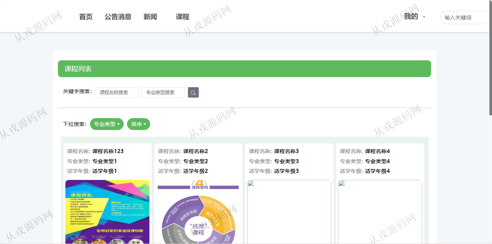

<h1 align="center">196.公选课在线选课管理系统</h1>

 获取sql文件 QQ: 386869957 QQ群: 377586148 

 [更多源码项目: 从戎源码网](https://armycodes.com/) 

## 简介

> 本代码来源于网络,仅供学习参考使用!
>
> 提供1.远程部署/2.修改代码/3.设计文档指导/4.框架代码讲解等服务
> 
> 管理后台：http://localhost:8080/
> 
> 管理员：admin admin
> 
> 用户端访问地址：http://localhost:8081/
> 
> 学生：student 123456
> 

## 项目介绍
基于springboot+vue2的公选课在线选课管理系统：前端 vue、elementui，后端 maven、springmvc、spring、mybatis；角色分为管理员、学生；集成课程、公告、新闻、在线选课等功能于一体的系统。

## 功能介绍

### 学生

- 基本功能：登录，注册，退出
- 网站首页：主导航栏，轮播图，全局搜索，课程推荐
- 课程：课程列表，课程关键词搜索，按专业类型分类，排序，课程详情，点赞，收藏，在线选课
- 公告消息：公告列表，公告详情
- 新闻：新闻局部搜索，新闻列表，新闻详情，点赞，收藏
- 我的：个人资料查看与修改，密码修改，收藏列表

### 管理员

- 公告管理：轮播图信息增删改查，公告栏信息的增删改查
- 用户管理：管理员信息的增删改查，教师信息的增删改查，学生信息的增删改查
- 新闻管理：新闻信息的增删改查，查看评论，新闻分类
- 专业分类管理：专业分类信息的增删改查，专业类型搜索
- 课程管理：课程信息的增删改查，课程图片上传，查看评论
- 学院管理：学院信息的增删改查
- 班级管理：班级信息的增删改查
- 成绩管理：成绩信息的增删改查

## 环境

- <b>IntelliJ IDEA 2021.3</b>

- <b>Mysql 5.7.26</b>

- <b>Node 14.14.0</b>

- <b>JDK 1.8</b>

## 运行截图

